 
 데이터베이스  1주차:  데이터와  데이터베이스 데이터베이스의  필요성

데이터와  정보

데이터:  현실세계에서  단순히  관찰하거나  측정하여 

수집한  사실이나  값

정보:  데이터를  처리한  결과물

정보처리:  데이터에서  정보를  추출하는  과정  또는  방법

`  `데이터를  분석,  해석하여  데이터간  관계  파악

데이터  ->정보처리->  정보 정보처리(데이터  해석)을  위해

1) 데이터  수집
1) 수집한  데이터를  효율적으로  저장
1) 정보  추출을  위해  데이터  관리

데이터베이스:  정보  시스템  안에  데이터  저장,  제공하는 

`       `핵심  역할

정보처리시스템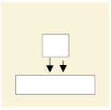

현실세계  ->  데이터  ->  처리  ->  정보  ->  의사결정자 데이터베이스

데이터베이스의  정의와  특징

데이터베이스:  여러  사용자가  공유하여  사용할  수  있도록

`       `통합해서  저장한  운영  데이터의  집합

데이터베이스의  개념

1) 통합된  데이터:  중복을  최소화하여  중복으로  인한 

`   `데이터  불일치  현상  제거

2) 저장된  데이터:  컴퓨터  저장장치에  저장된  데이터
2) 운영  데이터:  조직의  목적을  위해  사용,  업무검색  등
2) 공용  데이터:  공동으로  사용되는  데이터

데이터베이스의  특징

1) 실시간  접근성
1) 계속적인  변화
1) 동시  공유
1) 내용에  따른  참조:  물리적인  위치가  아님

데이터와  데이터베이스

데이터베이스의  특징2

1) 정형데이터: 

`     `구조화된  데이터

`     `엑셀,  관계  데이터베이스  테이블

2) 반정형데이터: 

`     `데이터  내용  안에  구조에  대한  설명과  함께  존재

`     `파싱(원하는  형식의  데이터변환)  필요

`     `보통  파일  형태로  저장(HTML,  XML, JSON  문서  등)

3) 비정형데이터:

`     `정해진  구조가  없이  저장된  데이터

데이터베이스  시스템

데이터베이스  시스템의  발전:  마당서점

[1단계]  마당서점의  시작  (마당서점  초기)

`   `도서  100권,  근처  학생,  주민,  사장이  직접

`   `회계업무(계산기),  장부에  기록

[2단계]  컴퓨터  도입  (마당서점  전산화)

`   `도서  1,000권,  근처  학생,  주민,  직원  고용

`   `회계  업무(컴퓨터),  파일  시스템

[3단계]  지점  개설,  데이터베이스  구축 

`   `(마당서점  DBMS  도입)

`   `10,000권,  서울  지역  고객

`   `회계업무(컴퓨터),  데이터베이스  시스템

`   `클라이언트/서버  시스템으로  지점  연결

[4단계]  홈페이지  구축  (마당서점  인터넷  서비스)

`   `100,000권,  국민(전국배송)

`   `회계/인사  업무(컴퓨터,  인터넷  사용),  웹  DB  시스템

`   `인터넷으로  도서  검색  및  주문  (DB가  회사  밖에  있음) [5단계]  인터넷  쇼핑몰  운영

`   `1,000,000권,  국민,  DB  서버  여러개  구축

`   `인터넷  종합  쇼핑  서비스  제공

정보시스템의  발전

파일시스템

- 데이터를  파일  단위로  파일  서버에  저장
- 각  컴퓨터는  LAN을  통해  파일  서버에  연결
- 각  응용프로그램이  독립적으로  파일을  다르기에 

`   `데이터가  중복  저장될  가능성  있음

- 동시에  파일을  다루기  때문에  데이터  일관성이  훼손될    수  있음  

  데이터베이스  시스템

- DBMS를  도입하여  데이터를  통합관리하는  시스템
- DBMS가  설치된  쪽을  서버,  외부에서  데이터를  요청    하는  쪽을  클라이언트라  함
- 서버가  파일  다루며  일관성유지,  복구,  동시제어  수행
- 데이터  중복을  줄이고  표준화해  무결성  유지함

웹  데이터베이스  시스템

- 데이터베이스를  웹  브라우저에서  사용할  수  있도록   서비스하는  시스템
- 불특정  다수  고객을  상대로  하는  온라인  상거래, 공공민원  서비스  등에  사용
- 인터넷  사용

분산  데이터베이스  시스템

- 여러  곳에  분산된  DBMS  서버를  연결하여  운영
- 대규모  응용  시스템에  사용됨

파일  시스템과  DBMS

파일시스템

- 데이터를  파일로  관리하기  위해  파일을 생성·삭제·수정·검색하는  기능을  제공하는  소프트웨어
- 응용  프로그램마다  필요한  데이터를  별도의  파일로 관리함

파일시스템의  문제점

- 같은  내용의  데이터가  여러  파일에  중복  저장       ->  데이터  중복성  (일관성,무결성  유지  어려움)
- 응용  프로그램이  데이터  파일에  종속적                ->  데이터  종속성
- 데이터  파일에  대한  동시  공유,  보안,  회복  기능이 부족
- 응용  프로그램  개발이  쉽제  않음

->  해결  방안:  통합해서  관리하기

데이터베이스  관리  시스템

- 파일  시스템  문제를  해결하기  위해  제시된  소프트웨어
- 조직에  필요한  데이터를  데이터베이스에  통합하여 저장하고  관리

데이터베이스  관리  시스템의  장단점

- 장점

`     `⦁데이터  중복을  통제할  수  있음

`     `⦁데이터  독립성  확보  ☆

`     `⦁데이터  동시공유  가능  ☆

`     `⦁데이터  보안이  향상

`     `⦁데이터  무결성  유지  ☆

`     `⦁표준화  가능  ☆

`     `⦁장애  발생시  회복  가능

`     `⦁응용  프로그램  개발  비용  감소

- 단점

`     `⦁비용이  많이  듦

`     `⦁백업과  회복  방법이  복잡

`     `⦁중앙  집중  관리로  인한  취약점  존재

데이터베이스  관리  시스템  분류

네트워크  DBMS:  데이터베이스를  그래프  형태로  구성    (네트워크상의  노드로  표현)

계층  DBMS:  데이터베이스를  트리  형태로  구성

`   `(부모  자식  관계가  명확한  경우에만  사용가능)

관계  DBMS:  데이터베이스를  테이블  형태로  구성

데이터베이스  시스템의  구성

스키마:  데이터베이스에  저장되는  데이터  구조와 

`   `제약조건을  정의한  것(설계과정의  정의),  자주 

`   `변경되지  않음

인스턴스:  스키마에  따라  데이터베이스에  실제로  저장된    값,  시간이  지남에  따라  계속해서  바뀜

3단계  데이터베이스  구조

- 데이터베이스를  관점에  따라  세  단계로  나눈  것
- 외부단계:  개별  사용자  관점

`   `일반  사용자나  응용프로그래머가  접근하는  계층, 

`   `여러개의  외부  스키마가  있을  수  있음. 

`   `(=서브스키마,  뷰)

- 개념단계:  조직  전체의  관점

`   `전체  데이터베이스의  정의를  의미,  하나의 

`   `데이터베이스에는  하나의  개념  스키마가  있음

- 내부단계:  물리적인  저장장치의  관점

`   `물리적  저장  장치에  데이터베이스가  실제로  저장되는    방법의  표현.  필드  크기,  데이터  레코드의  배치  방법, 

`   `레코드  접근  경로,  데이터  압축  등에  관한  사항이  포함

데이터베이스를  3단계  구조로  나누고  단계별로  스키마를 유지하며  스키마  사이의  대응  관계를  정의하는  궁극적인 목적  ->  데이터  독립성  실현

데이터베이스  언어

- 사용자와  데이터베이스  관리  시스템  간의  통신  수단    사용목적에  따라  구분
- 데이터  정의어(DDL,  Definition)

`   `스키마  정의,  수정,  삭제

- 데이터  조작어(DML,  Manipilation)

`   `데이터의  삽입·삭제·수정·검색  등의  처리를  요구하기 

`   `위해  사용

`   `절차적(what,  how),  비절차적(what,  선언적)으로  나뉨

- 데이터  제어어(DCL,  Control)

`   `내부적으로  필요한  규칙이나  기법을  정의

`   `무결성,  보안,  회복,  동시성  제어를  위해  사용

데이터베이스  2주차:  관계  데이터  모델 관계  데이터  모델의  개념

데이터베이스  모델링

- 현  세계에서  사용되는  작업이나  사물들을  DBMS의 데이터베이스  개체로  옮기기  위한  과정

  릴레이션(relation):  x와  y의  관계,  테이블 도메인(domain,  Dom):  x가  될  수  있는  것 Range(Rng):  y값

  릴레이션의  구성

  릴레이션의  스키마:  ☆

- 릴레이션의  논리적  구조
- 스키마의  구성요서:  속성,  도메인,  차수
- 릴레이션의  이름과  릴레이션에  포함된  모든  속성 이름으로  정의
  - 릴레이션이름(속성1:  도메인1,  속성2:  도메인2...)
  - 고객(고객아이디,  고객이름,  나이...)
- 릴레이션  내포(intension)라고도  함
- 정적인  특징이  있음(변화  x)

릴레이션  인스턴스:  ☆

관계  데이터  모델의  기본  개념  ☆ - 어느  한  시점에  릴레이션에  존재하는  투플의  집합

- 하나의  개체에  대한  데이터를  하나의  릴레이션에  저장 - 인스턴스의  요소:  튜플,  카디날리티
- 데이터를  2차원  테이블  형태인  릴레이션(동일한  - 릴레이션  외연(extension)이라고도  함

  구조)으로  표현 - 동적인  특징이  있음

관계  데이터  모델의  기본  용어

릴레이션:

- 행과  열로  구성된  테이블
- 하나의  개체에  관한  데이터를  2차원  테이블의    

`      `구조로  저장한  것

- 파일  관리  시스템  관점에서  파일에  대응

속성(attribute):

- 릴레이션의  열,  애트리뷰트
- 파일  관리  시스템  관점에서  필드에  대응

투플(tuple):

- 릴레이션의  행
- 파일  관리  시스템  관점에서  레코드에  대응

도메인(domain):

- 하나의  속성이  가질  수  있는  모든  값의  집합
- 속성  값을  입력  및  수정할  때  적합성  판단의  기준  됨
- 속성의  특성을  고려한  데이터  타입으로  정의

차수(degree):

- 하나의  릴레이션에서  속성의  전체  개수
- 최수  차수는  1(열들의  개수)
- 릴레이션의  차수는  자주  바뀌지  않음

카디널리티(cardicality):

- 하나의  릴레이션에서  투플의  전체  개수(행  개수)
- 유효한  릴레이션은  카디날리티  0을  가질  수  없음
- 시간이  지남에  따라  계속  변함

널(null): 

- 속상  값을  아직  모르거나  해당되는  값이  없음을  표현
- 숫자  도메인의  0이나  문자  도메인의  공백  문자  또는 

`    `공백  문자열과  다름(비교가  불가)

릴레이션  구조와  관련된  용어

|릴레이션 |용어|같은  의미로 통용되는  용어|파일  시스템  용어|
| - | - | - | - |
|릴레이션||테이블|파일|
|스키마||내포|헤더|
|인스턴스||외연|데이터|
|투플||행|레코드|
|속성||열|필드|

릴레이션의  특성

1) 속성은  단일  값을  가짐  (속성의  원자성)
1) 속성은  서로  다른  이름을  가짐 
1) 한  속성의  값은  모두  같은  도메인  값을  가짐 
1) 속성의  순서는  상관없음  (속성의  무순서)
1) 중복된  투플은  허용하지  않음  (투플의  유일성)
1) 투플  순서는  상관없음　(투플의  무순서)

데이터베이스의  구성

데이터베이스  스키마:

- 데이터베이스의  전체구조
- 데이터베이스를  구성하는  릴레이션  스키마  모음

데이터베이스  인스턴스: 

- 데이터베이스를  구성하는  릴레이션  인스턴스  모음

`   `고객  릴레이션      상품  릴레이션       주문  릴레이션 릴레이션  스키마1    릴레이션  스키마2    릴레이션  스키마3   

릴레이션인스턴스1   릴레이션인스턴스2  릴레이션인스턴스3 데이터베이스  스키마:  릴레이션  스키마  1+2+3

데이터베이스  인스턴스:  릴레이션  인스턴스  1+2+3

키(key)

`  `⦁릴레이션에서  특정  투플을  식별할  때  사용되는  속성,    속성들의  집합

`  `⦁키는  릴레이션  간의  관계를  맺는데도  사용

키의  특성

`  `⦁유일성:  키가  되는  속성(혹은  속성의  집합)은  반드시     값이  달라서  투플들을  서로  구별할  수  있어야  함   ⦁최소성:  꼭  필요한  최소한의  속성들로만  키를  구성

키의  종류

- 슈퍼키:  투플을  유일하게  식별할  수  있는  하나의  속성 

`   `혹은  속성의  집합,  투플들을  구별할  수만  있으면  모두

`   `슈퍼키가  될  수  있음

- 후보키:  투플을  유일하게  식별할  수  있는  속성의  최소 집합,  모든  릴레이션에는  최소한  1개  이상의  후보키가 있음,  2개  이상의  속성으로  이루어진  키를  복합키라고 함
- 기본키:  여러  후보키(집합)  중  하나를  선정하여  대표로 

  삼는  키,  릴레이션  스키마를  표현할  때  기본키는 

  밑줄을  그어  표시함

* 기본키  선정시  고려사항

`     `고유한  값을  가져야함

`     `NULL 값은  허용하지  않음

`     `키  값의  변동이  일어나지  않아야함

`     `최대한  적은  수의  속성을  가진  것이어야  함

- 대리키:  기본키가  보안을  요하거나,  여러개의  속성으로 구성되어  복잡하거나,  마땅한  기본키가  없을  때 일련번호와  같은  가상의  속성을  만들어  기본키로  삼는 경우.  인조키라고도  함.

`   `임의로  생성하는  값으로  그  값의  의미를  알  수  없음

- 대체키:  기본키로  선정되지  않은  후보키

`    `기본키       대체키              슈퍼키

`   `후보키  중    기본키로        선정된  키    선정안된     

후보키

릴레이션  내  투플을  식별 할  수  있는  속성의  집합

- 외래키☆:  다른  릴레이션의  기본키를  참조하는  속성☆

`   `참조하고(외래키  가짐)  참조되는(외래키가  참조하는 

`   `기본키를  가짐)  양쪽의  릴레이션의  도메인은  서로 

`   `같아야  함

`   `하나의  릴레이션에는  외래키가  여러개  존재할  수  있고    외래키를  기본키로  사용할  수도  있음

`   `외래키의  속성은  널  값을  가질  수도  있음

`   `같은  릴레이션의  기본키를  참조하는  외래키도  정의가능

데이터베이스  3주차:  관계  데이터  모델 무결성  제약조건

무결성  제약조건  ☆

ー　데이터의  무결성을  보장하고  일관된  상태로  유지하기 　　위한  규칙

- 데이터의  무결성:  저장된  데이터의  일관성과  정확성을 지키는  것.  DBMS의  중요한  기능이며,  데이터에 

  적용되는  연산에  제한을  두어  데이터  무결성  유지

- DBMS에서  데이터  무결성  제약조건을  정의하면 응용프로그래머들은  추가  검사를  위한  프로그램  작성을 피할  수  있음
- 제약조건  종류:  도메인,  개체,  참조  무결성  제약조건☆

도메인  무결성  제약조건(=도메인  제약)

⦁릴레이션  내의  투플들이  각  속성의  도메인에  지정된    값만을  가져야  한다는  조건

⦁SQL문에서  데이터  형식(type),  널(NULL),  기본 

`   `값(default),  체크(check)등을  사용하여  지정할  수  있음 ⦁제약대상:  속성

⦁제약조건  개수:  속성의  개수와  동일

개체  무결성  제약조건(=기본키  제약)

⦁릴레이션은  기본키를  지정하고  그에  따른  무결성  원칙 ⦁기본키는  NULL값을  가져서는  안되며  릴레이션  내에     오직  하나의  값만  존재해야함

⦁제약대상:  투플

⦁제약조건  개수:  1개

참조  무결성  제약조건(=외래키  제약)

⦁릴레이션  간의  참조  관계를  선언하는  제약조건

⦁자식  릴레이션(참조하는)의  외래키는  부모 

`   `릴레이션(참조되는)의  기본키와  도메인이  동일해야 

`   `하며,  자식  릴레이션  값이  변경될  때  부모  릴레이션의    제약을  받음 

⦁제약대상:  속성,  투플

⦁제약조건  개수:  0  ~  여러개

참조  무결성  제약조건

삽입

- 부모  릴레이션:  투플  삽입  후  수행하면  정상적으로  

`   `진행

- 자식  릴레이션:  참조받는  테이블에  외래키  값이  없는      경우  삽입이  금지

  삭제

- 부모  릴레이션:  참조하는  테이블을  같이  삭제할  수 있어서  금지하거나  다른  추가  작업이  필요
- 자식  릴레이션:  바로  삭제  가능
* 부모  릴레이션에서  투플을  삭제할  경우  참조  무결성    조건을  수행하기  위한  고려사항

  `   `⦁즉시  작업을  중지

  `   `⦁자식  릴레이션의  관련  투플을  삭제

  `   `⦁초기에  설정된  다른  어떤  값으로  변경(0)

  `   `⦁NULL 값으로  설정

  수정

- 삭제와  삽입  명령이  연속해서  수행됨
- 부모  릴레이션의  수정이  일어날  경우  삭제  옵션에  따라 처리  된  후  문제가  없으면  다시  삽입  제약조건에  따라 처리됨
* 참조  무결성  조건에서  부모  릴레이션  투플을  삭제할 

`     `경우

`   `⦁RESTRICTED:  요청한  삭제  작업중지(에러  처리)

`   `⦁CASCADE:  학생  릴레이션의  해당  투플을  같이 

`     `연쇄적으로  삭제

`   `⦁기본값으로  변경(미리  설정한  값,  DEFAULT)

`   `⦁NULL 값으로  설정

무결성  제약조건(예)

삽입

- 참조되는  릴레이션에  새로운  투플이  삽입되면  참조 무결성  제약조건은  위배  안됨(속성  값에  따라서  도메인 제약조건,  키  제약조건  등을  위배할  수  있음)
- 참조하는  릴레이션에  새로운  투플을  삽입할  때는 도메인  제약조건,  키  제약조건  외에  참조  무결성 제약조건도  위배할  수  있음

개체  무결성  제약조건

삽입:  기본키  값이  같으면  삽입이  금지

수정:  기본키  값이  같거나  NULL로도  수정이  금지 삭제:  특별한  확인이  필요하지  않으며  즉시  수행함

삭제

- 참조하는  릴레이션에서  투플이  삭제되면  모든 제약조건을  위배하지  않음
- 참조되는  릴레이션에서  투플이  삭제되면  참조  무결성 제약조건을  위배하는  경우가  생기거나  생기지  않을  수 있음

참조  무결성  제약조건을  만족시키기  위해  DBMS가 제공하는  옵션

- 제한:  위배를  야기한  연산을  단순히  거절
- 연쇄:  참조되는  릴레이션에서  투플  삭제,  참조하는 릴레이션에서  이  투플을  참조하는  투플들도  함께  삭제
- 널값(NULL): 참조되는  릴레이션에서  투플을  삭제하고 참조하는  외래  키에  널값을  삽입
- 디폴트값:  위에서  널값  대신  디폴트값을  넣음

관계  데이터  연산

관계데이터  연산의  개념

데이터  모델  구성  =  데이터  구조  +  제약조건+  연산

- 관계  데이터  연산:  원하는  데이터를  얻기  위해 

`   `릴레이션에  필요한  처리  요구를  수행하는  것☆

- 대표적인  관계  데이터  연산:  관계  대수,  관계  해석

`   `⦁관계  대수:  데이터의  처리  과정을  순서대로  기술

`   `⦁관계  해석:  처리를  원하는  데이터가  무엇인지만  기술

관계대수

관계대수(=절차언어)의  개념

- 원하는  결과를  얻기  위해  릴레이션의  처리  과정을 순서대로  기술하는  언어
- 릴레이션을  처리하는  연산자들의  모임

`   `⦁대표  연산자  8개

`   `⦁일반  집합  연산자  4개

- 폐쇄  특성이  존재함  -  피연산자도  릴레이션이고 연산의  결과도  릴레이션임

관계의  수학적  의미

⦁릴레이션의  수학적  개념:  릴레이션  R은  카티전 

`   `프로덕트의  부분집합으로  정의

⦁릴레이션  역시  집합이므로  집합에서  가능한  연산은    합집합,  교집합,  카티전  프로덕트  등이  있음

|||||합집합|∪|
| :- | :- | :- | :- | - | - |
|||||교집합|∩|
|||일반집합 |연산자|차집합|-|
|관계대수 |연산자|||카티션 프로덕트|x|
|||||셀렉트||
|||순수관계 |연산자|프로젝션||
|||||조인|⋈|
|||||디비전|÷|

일반집합  연산자

- 릴레이션이  투플의  집합이라는  개념을  이용하는  연산자
  - 합집합  (R∪S)
  - 교집합  (R∩S)
  - 차집합  (R-S)
  - 카티션  프로덕트  (RxS)
    - 릴레이션  R의  각  투플과  릴레이션  S의  각  투플을 

`   `모두  연결하여  만든  새로운  투플을  반환

순수관계  연산자

- 셀렉트  (조건 **)  :릴레이션  R에서  조건을  만족하는 투플들을  반환
- 프로젝션  (속성리스트 **):  릴레이션  R에서  주어진 

  속성들의  값으로만  구성된  투플들을  반환

- 조인  (R  ⋈  S):  공통  속성을  이용해  릴레이션  R과  S의 투플들을  연결하여  만든  새로운  투플들을  반환
- 디비전  (R  ÷  S):  릴레이션  S의  모든  투플과  관련이 있는  릴레이션  R의  투플들을  반환

관계대수식

- 관계대수의  연산을  수행하기  위한  식
- 대상이  되는  릴레이션과  연산자로  구성
- 결과는  릴레이션으로  반환
- 반환된  릴레이션은  릴레이션의  모든  특징을  따름    ⦁단항연산자:  연산자<조건>릴레이션

`   `⦁이항연산자:  릴레이션1  연산자<조건>  릴레이션

관계대수  식의  사용  예

|A|B|C||||
| - | - | - | :- | :- | :- |
|a1|b1|c1||||
|a2|b3|c3||||
|a3|b4|c2||||
|A|B|C||||
|a1|b1|c1||||
|a2|b3|c3||||
|a3|b3|c1||||

⦁셀렉션  -  **or****:  R1에서  조건에  맞는  투플을    추출함

|A|B|C|
| - | - | - |
|a1|b1|c1|
|a2|b3|c3|

⦁프로젝션  -  ******:  R2에서  조건에  맞는  속성만을     추출

|A|B|
| - | - |
|a1|b1|
|a2|b3|
|a3|b3|

⦁합집합  -  R1∪R2:  R1과  R2의  합집합을  구함

|A|B|C|
| - | - | - |
|a1|b1|c1|
|a2|b3|c3|
|a3|b4|c2|
|a3|b3|c1|

⦁차집합  –  R1-R2:  R1과  R2의  차집합을  구함

|A|B|C|
| - | - | - |
|a3|b4|c2|

`  `⦁조인  R1⋈****R2:  R1과  R2의  카티전  프로덕트를     구하여  조건에  맞는  투플을  추출

|R1.A|R1.B|R1.C|R2.A|R2.B|R2.C|
| - | - | - | - | - | - |
|a1|b1|c1|a1|b1|c1|
|a1|b1|c1|a3|b3|c1|
|a2|b3|c3|a2|b3|c3|

- 셀렉션:  릴레이션의  투플을  추출하기  위한  연산   형식:  <조건>(R릴레이션)                               조건식:  속성과  상수의  비교나  속성들  간의  비교로 표현,  비교연산자와  논리연산자를  이용                확장:  형식:  <복합조건>(R)                        여러개의  조건을  ∧<and>,  ∨<or>,  ㄱ<not>  기호를 이용하여  복합조건  표현                            조건식조건식릴 레이 션  조건식릴 레이 션 

   조건식∧조건식릴레이션 

- 프로젝션:  릴레이션의  속성을  추출하기  위한  연산      형식:   속성리스트 **
- 합집합:  두  릴레이션을  합하여  반환,  서로  같은  속성 순서와  도메인을  가져야함                        결과릴레이션의  특성:

`   `⦁차수는  릴레이션의  R과  S의  차수와  같음

`   `⦁카디널리티는  릴레이션  R과  S의  카디널리티를  더한      것과  같거나  적어짐

`   `교환적  특징이  있음  (R∪S  =  S∪R)

`   `결합적  특징이  있음  (R∪S)∪T =  R∪(S∪T)

- 교집합:  합병가능한  두  릴레이션을  대상으로,  두 릴레이션이  공통으로  가지고  있는  투플을  반환         결과릴레이션의  특성:

`   `⦁차수는  릴레이션  R과  S의  차수와  같음

`   `⦁카디널리티는  릴레이션  R과  S의  어떤 

`     `카디널리티보다  크지  않음

`   `교환적,  결합적  특징이  있음

- 차집합:  첫  번째  릴레이션에는  속하고  두  번째 릴레이션에는  속하지  않는  투플을  반환

`   `결과  릴레이션의  특성

`   `⦁차수는  릴레이션  R과  S의  차수와  같음

`   `⦁R-S의  카디널리티는  릴레이션  R의  카디널리티와      같거나  적음

`   `⦁S-R의  카디널리티는  릴레이션  R의  카디널리티와      같거나  적음

`   `교환적,  결합적  특징이  없음

- 카티전  프로덕트:  두  릴레이션을  연결시켜  하나로  합칠 때  사용.  차수는  두  릴레이션의  차수의  합이며, 카디널리티는  두  릴레이션의  카디날리티의  곱

`   `결과  릴레이션의  특성

`   `⦁차수는  릴레이션  R과  S의  차수를  더한  것과  같음

`   `⦁카디널리티는  릴레이션  R과  S의  카디널리티를  곱한      것과  같음

`   `교환적,  결합적  특징이  있음

- 조인:  두  릴레이션의  공통  속성을  기준으로  속성  값이 같은  투플을  수평으로  결합하는  연산.  조인에  참여하는 속성이  서로  동일한  도메인으로  구성되어야  함

`   `조인  연산의  구분:

`   `⦁기본연산:  세타조인(⋈ ),  동등조인(⋈),  자연조인(⋈ )

* 
*

`   `⦁확장된  조인연산:  세미조인(⋉,⋊),외부조인(⟕,⟖,⟗)

- 세타조인:  조인에  참여하는  두  릴레이션의  속성  값을 비교하여  만족하는  투플만  반환.  조건(A)은 {=,≠,≤,≥,<,>}  중  하나가  됨
- 동등조인:  세타조인에서  {=}  연산자를  사용한  조인. 보통의  조인  연산 
- 자연조인:  동등조인에서  조인에  참여한  속성이  두  번 나오지  않도록  두  번째  속성을  제거한  결과를  반환   형식 :  **⋈*
*******

- 외부조인:  자연조인  시  조인에  실패한  투플을  모두 보여주되  값이  없는  대응  속성에는  NULL 값을  채워서 반환.  기준  릴레이션  위치에  따라  왼쪽,  오른쪽,  완전 외부조인으로  나뉨(왼쪽-⟕,  오른쪽-⟖,  완전-⟗)
- 세미조인:  자연조인을  한  후  두  릴레이션  중  한쪽 릴레이션의  결과만  반환,  기호에서  닫힌  쪽  릴레이션의 투플만  반환
- 디비전:  릴레이션의  속성  값의  집합으로  연산을  수행

데이터베이스  4주차:  데이터  모델링과  SQL(1) 개체-관계  모델

데이터  모델링

- 현실  세계에  존재하는  데이터를  데이터베이스로  옮기는    변환  과정.  데이터베이스  설계의  핵심  과정

  데이터  모델의  종류

- 개념적  데이터  모델:  현실  세계를  데이터베이스의 개념적  구조로  표현

`   `예)  개체-관계  모델

- 논리적  데이터  모델:  개념적  구조를  데이터베이스의 논리적  구조로  표현

`   `예)  관계  데이터  모델

현실세계->개념적  모델링->개념  세계->논리적  모델링->컴퓨터세계

개체-관계  모델(E-R  model) 

- 개체와  개체  간의  관계를  이용해  현실  세계를  개념적      구조로  표현
- 핵심  요소:  개체,  속성,  관계

  개체-관계  다이어그램(E-R  diagram)

- 개체-관계  모델을  이용해  현실  세계를  개념적으로 

`   `모델링한  결과물을  그림으로  표현한  것

개체

- 사람이나  사물과같이  구별되는  모든  것
- 저장할  가치가  있는  중요한  데이터를  가지고  있는 사람,  사물,  개념,  사건  등
- 다른  개체와  구별되는  이름을  가지고  있고,  각 개체만의  고유한  특성이나  상태,                    

  즉  속성을  하나  이상  가지고  있음

`   `예)  서점에  필요한  개체:  고객,  책

- E-R  다이어그램에서  사각형으로  표현하고  안에  이름 표기

속성: 

- 개체나  관계가  가지고  있는  고유한  특성
- 의미  있는  데이터의  가장  작은  논리적  단위
- E-R  다이어그램에서  타원으로  표현하고  타원  안에 이름을  표기

고객

`       `고객아이디           고객명

속성의  분류

|단일  값  속성|
| - |
|다중값  속성|
|단순속성|
|복합속성|
|유도  속성|

속성  값의  개수

속성

의미  분해  가능성

기존  속성  값에서  유도

단일  값  속성과  다중  값  속성

- 단일  값  속성:  값을  하나만  가질  수  있는  속성

`   `예)  고객  객체의  이름,  적립금  속성

- 다중  값  속성:  값을  여러개  가질  수  있는  속성,     E-R  다이어그램에서  이중  타원으로  표현

`   `예)  고객  개체의  연락처  속성,  책  개체의  저자  속성

단순  속성과  복합  속성

- 단순  속성:  의미를  더는  분해할  수  없는  속성

`   `예)  고객  객체의  적립금  속성,  책  개체의  이름

- 복합  속성:  의미를  분해할  수  있는  속성

`   `예)  고객  객체의  주소  속성,  생년월일  속성(년,  월,  일)

유도  속성

- 기존의  다른  속성  값에서  유도되어  결정되는  속성  값이    별도로  저장되지  않음
- E-R  다이어그램에서  점선  타원으로  표현

  `   `예)  책  개체의  가격과  할인율  속성으로  계산되는  

  `       `판매가격  속성

  키  속성  ☆

- 각  개체  인스턴스를  식별하는데  사용되는  속성
- 모든  개체  인스턴스의  키  속성  값이  다름
- 둘  이상의  속성드로  구성되기도  함
- E-R  다이어그램에서  밑줄로  표현

관계  ☆

- 개체와  개체가  맺고  있는  의미  있는  연관성
- 개체  집합들  사이의  대응  관계,  즉  매핑을  의미
- E-R  다이어그램에서  마름모로  표현 

`   `예)  고객  개체와  책  개체  간의  구매  관계

관계의  유형

- 일대일  관계
- 일대다  관계
- 다대다  관계

개체타입:  개체를  고유한  이름과  속성들로  정의한  것 개체  인스턴스:  개체를  구성하고  있는  속성이  실제  값을 가짐으로써  실체화된  개체

개체  집합:  특정  개체  타입에  대한  개체  인스턴스들을 모아놓은  것

관계의  참여  특성

- 필수적  참여(전체  참여):  모든  개체가  인스턴스  관계에 반드시  참여,  E-R다이어그램에서  이중선으로  표현

`   `예)  고객  개체가  책  개체와의  구매  관계에  필수적으로        참여  (모든  고객은  책을  반드시  구매해야  함)

- 선택적  참여(부분  참여):  개체  중  일부만  관계에  참여

`   `예)  책  개체가  고객  개체와의  구매  관계에  선택적  참여        (고객이  구매하지  않은  책이  존재할  수  있음)

관계의  종속성

- 약한  개체:  다른  개체의  존재  여부에  의존적
- 강한  개체:  다른  개체의  존재  여부를  결정하는  개체
- 특징:

`   `⋅강한  개체와  약한  개체는  일반적으로  일대다  관계

`   `⋅약한  개체는  강한  개체와의  관계에  필수적으로  참여    ⋅약한  개체는  강한  개체의  키를  포함하여  키를  구성

- E-R  다이어스램에서  약한  개체는  이중  사각형으로 

`   `표현,  약한  개체가  강한  개체와  맺는  관계는  이중 

`   `마름모로  표현

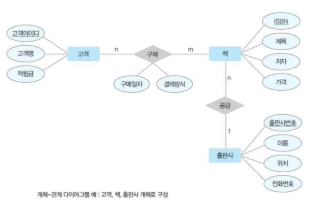

SQL  실습환경  구축

SQL:  관계  데이터베이스를  위한  표준  질의어,  쿼리  언어

SQL  기능에  따른  분류  ☆

- 데이터  정의어(DDL):  테이블이나  관계의  구조를 생성하는  데  사용,  CREATE,  ALTER,  DROP  문
- 데이터  조작어(DML):  테이블에서  데이터  검색,  삽입, 수정,  삭제하는  데  사용,  SELECT(질의어,  query), INSERT,  DELETE,　UPDATE  문
- 데이터  제어어(DCL):  데이터  사용  권한을  관리하는데 사용,  GRANT,  REVOKE 문

SQL  실습환경  -  웹  서비스  구성요소

1) 클라이언트가  서버에  서비스  요청
1) 서버는  해당  정보를  주기  위해  PHP에  스크립트  실행 요청
1) PHP는  미리  작성된  프로그램을  통해  MySQL에  요청
1) MySQL는  요청에  대한  결과를  PHP에  전달
1) PHP는  받은  결과를  HTML로  변경  후  서버에  전달
1) 서버는  받은  HTML파일을  클라이언트에  전달

phpMyAdmin

- MySQL을  월드  와이드  웹상에서  관리할  목적으로     PHP로  작성한  오픈소스  툴
- 데이터베이스,  테이블,  필드,  열의  작성,  수정,  삭제, SQL  상태  실행,  사용자  및  사용  권한  관리  등의 전체적인  관리  작업을  수행

  데이터  정의어

  SQL의  데이터  정의  기능  ☆

- 테이블  생성:  CREATE　TABLE
- 테이블  변경:  ALTER　TABLE
- 테이블  삭제:  DROP  TABLE

테이블  생성:  CREATE  TABLE 문  ☆

*CREATE  TABLE   테이블\_이름(*

1) *속성\_이름     데이터\_타입   [NOT  NULL]   [DEFALUT  기본\_값]*
1) *[PRIMARY  KET  (속성\_리스트)]*
1) *[UNIQUE  (속성\_리스트)]*
1) *[FOREIGN  KEY  (속성\_리스트)  REFERENCES  테이블\_이름(속성\_리스트)]*

`         `*[ON  DELETE  옵션]  [ON  UPDATE  옵션]*

5) *[CONSTRAINT  이름]  [CHECK(조건)]*

*);*

1) 테이블을  구성하는  각  속성의  이름,  데이터  타입,     기본제약  사항  정의
1) 기본키  정의
1) 대체키  정의
1) 외래키  정의
1) 데이터  무결성을  위한  제약조건  정의
- []의  내용은  생략이  가능
- SQL  문은  세미콜론(;)으로  문장의  끝을  표시
- SQL  문은  대소문자를  구분하지  않음

- 속성의  정의:  테이블을  구성하는  각  속성의  데이터 타입을  선택한  후에  널  값  허용  여부와  기본  값  필요 여부를  결정
- NOT NULL: 속성이  널  값을  허용하지  않음을  의미
- DEFAULT: 속성의  기본  값을  지정하는  키워드         \*문자열이나  날짜  데이터는  작은따옴표로  묶어서  표현     (작은  따옴표로  묶인  문자열은  대소문자를  구분함)
- 키의  정의  PRIMARY KEY: 기본키  지정
- UNIQUE:  대체키  지정,  유일성을  가지며  널  값이  허용
- FOREIGN  KEY: 외래키  지정,  어떤  속성을 참조하는지는  REFERENCES  키워드  다음에  제시       
- 참조  무결성  제약조건  유지를  위해  참조  테이블의  투플 삭제시  처리  방법  옵션:

`   `⋅ON  DELETE NO  ACTION: 투플을  삭제하지  못하게

`   `⋅ON  DELETE CASCADE:  관련  투플을  함께  삭제

`   `⋅ON  DELETE SET  NULL: 관련  투플  외래키값  NULL    ⋅ON  DELETE SET  DEFAULT: 미리  지정한  기본값

- 데이터  무결성  제약조건  정의

`   `CHECK:  테이블에  정확하고  유효한  데이터를  유지하기    위해  특정  속성에  대한  제약  조건을  지정, 

`   `CONSTRAINT 키워드와  함께  고유의  이름을  부여

테이블  변경:  ALTER TABLE문  ☆

- 새로운  속성  추가

*ALTER  TABLE  테이블\_이름*

`      `*ADD  속성\_이름  데이터\_타입  [NOT  NULL]  [DEFAULT  기본\_값];*

- 기존  속성  삭제

*ALTER  TABLE  테이블\_이름  DROP  COLUMN  속성\_이름;*

⋅만약,  삭제할  속성과  관련된  제약  조적이나  참조하는

`   `다른  속성이  존재한다면  속성  삭제가  수행되지  않음,    관련된  제약조건이나  참조하는  다른  속성을  먼저  삭제

- 새로운  제약조건의  추가

*ALTER  TABLE  테이블\_이름  ADD  CONSTRAINT  제약조건\_이름 제약조건\_내용;*

- 기존의  제약조건의  삭제

*ALTER  TABLE  테이블\_이름  DROP  CONSTRAINT  제약조건\_이름;*

-테이블  삭제

*DROP  TABLE  테이블\_이름;*

⋅만약,  삭제할  테이블을  참조하는  테이블이  있다면 

`   `삭제가  수행되지  않음,  관련된  외래키  제약조건을  먼저    삭제해야  함

데이터베이스  5주차:  데이터  모델링과  SQL(2) 데이터  조작어(검색)

SQL  데이터  조작기능  ☆

데이터  검색,  새로운  데이터  삽입,  데이터  수정,  데이터 삭제

- 데이터  검색:  SELECT
- 데이터  삽입:  INSERT
- 데이터  수정:  UPDATE
- 데이터  삭제:  DELETE

데이터  검색:  SELECT  문

- SELECT  키워드와  함께  검색하고  싶은  속성의  이름을 나열
- FROM  키워드와  함께  검색하고  싶은  속성이  있는 테이블의  이름을  나열
- 검색  결과는  테이블  형태로  반환됨

*SELECT  [ALL:DISTINCT]  속성\_리스트 FROM  테이블\_리스트;*

- ALL: 결과  테이블이  투플의  중복을  허용,  생략  가능
- DISTINCT: 결과  테이블이  투플의  중복을  허용  안함

기본검색

- AS  키워드를  이용해  속성의  이름을  바꾸어  출력  가능
- 새로운  이름에  공백이  포함되면  큰따옴표나  작은따옴표
- AS는  생략  가능

산술식을  이용한  검색

- SELECT  키워드와  함께  산술식  제시
- 산술식:  속성의  이름과  +,-,\*,/  등의  산술  연산자와 상수로  구성
- 결과  테이블에서만  계산된  결과  값이  출력됨

`   `⋅속성의  값이  실제로  변경되는  것은  아님

조건  검색

- 조건을  만족하는  데이터만  검색

*SELECT  [ALL:DISTINCT]  속성\_리스트 FROM  테이블\_리스트*

*[WHERE  조건];*

- WHERE  키워드와  함께  비교  연산자와  논리  연산자를 이용한  검색  조건  제시

⋅숫자뿐만  아니라  문자나  날짜  값을  비교하는  것도      가능

`   `⋅조건에서  문자나  날짜  값은  작은따옴표로  묶어서 

표현

LIKE를  이용한  검색

- LIKE 키워드를  이용해  부분적으로  일치하는  데이터 검색
- 문자열을  이용하는  조건에만  LIKE 키워드  사용  가능
- %:  0개  이상의  문자
- \_:  1개의  문자

`   `⋅LIKE‘데이터%’:  데이터로  시작하는  문자열

`   `⋅LIKE‘%데이터’:  데이터로  끝나는  문자열

`   `⋅LIKE‘%데이터%’:  데이터가  포함된  문자열

`   `⋅LIKE‘데이터\_\_\_’:  데이터로  시작하는  6자  길이  문자열    ⋅LIKE‘\_\_한%’:  세  번째  글자가  ‘한’인  문자열

NULL을  이용한  검색

- IS  NULL 키워드를  이용해  특정  속성의  값이  널 값인지를  비교
- IS  NOT NULL 키워드를  이용해  특정  속성의  값이  널 값이  아닌지를  비교
- 검색조건에서  널  값은  다른  값과  비교하면  결과가  모두 거짓이  됨

정렬  검색

- ORDER  BY 키워드를  이용해  결과  테이블  내용을 사용자가  원하는  순서로  출력

`   `⋅오름차순(기본):  ASC  /  내림차순:  DESC

`   `⋅널  값은  오름차순에서는  맨  마지막  출력,

`     `내림차순에서는  맨  먼저  출력(다를수도  있음)

`   `⋅여러  기준에  따라  정렬하려면  정렬  기준이  되는      속성들을  차례대로  제시

집계  함수를  이용한  검색

- 특정  속성  값을  통계적으로  계산한  결과를  검색하기 위해  집계  함수를  이용
- 집계  합수(=열함수):  개수,  합계,  평균,  최댓값, 최솟값의  계산  기능  제공
- 집계  함수  사용시  주의사항

`   `⋅집계  함수는  널인  속성  값은  제외하고  계산함

`   `⋅집계  함수는  WHERE  절에서는  사용할  수  없고, 

`     `SELECT  절이나  HAVING 절에서만  사용  가능

`   `⋅COUNT는  어떤  속성을  사용하냐에  따라  다르게  나옴    ⋅SUM,  AVG는  숫자데이터만  가능

그룹별  검색  ☆

*SELECT  [ALL:DISTINCT]  속성\_리스트                [기본검색] FROM  테이블\_리스트                               [기본검색] [WHERE  조건]                                    [조건검색] [GROUP  BY  속성\_리스트  [HAVING  조건]]         [그룹별  검색] [ORDER  BY  속성\_리스트  [ASC:DESC]];          [정렬검색]*

- GROUP  BY 키워드를  통해  특정  속성값이  같은  투플 모아  그룹  만들고  그룹별  검색
- HAVING 키워드와  함께  그룹에  대한  조건  작성  가능

여러  테이블에  대한  조인  검색

- 조인  검색:  여러  개의  테이블을  연결하여  데이터를 검색하는  것
- 조인  속성:  조인  검색을  위해  테이블을  연결해주는 

  속성

`   `⋅연결하려는  테이블  간에  조인  속성의  이름은  달라도      도메인은  같아야  함

`   `⋅일반적으로  외래키를  조인  속성으로  이용함

- FROM  절에  검색에  필요한  모든  테이블을  나열
- WHERE  절에  조인  속성의  값이  같아야  함을  의미하는 조인  조건을  제시
- 속성  이름  앞에  해당  속성이  소속된  테이블의  이름을 표시
- FROM  절에서  테이블의  이름을  대신하는  단순한 별명을  제시하여  질의문을  작성하는  것도  좋음

데이터베이스  6주차:  데이터  모델링과 데이터  조작어(검색)

데이터  검색:  SELECT  문

- INNER JOIN:  여러테이블에  대한  조인  검색

*SELECT  속성\_리스트*

*FROM  테이블1  INNER  JOIN  테이블2  ON  조인조건 [WHERE  검색조건]*

SQL(3) ⋅MySQL에는  INTERSECT  연산자가  없음

|
SELECT  주문고객 FROM  주문

WHERE  수량  >= 30 INTERSECT SELECT  고객아이디 FROM  고객

WHERE  나이  >= 30
|
SELECT  주문고객 FROM  주문

WHERE  수량  >= 30 AND

주문고객  IN (SELECT  고객아이디 FROM  고객

WHERE  나이  >= 30);
|
| :- | :- |

- OUTER  JOIN:  조인  조건을  만족하지  않는  투플에 대해서도  검색(검색  대상  테이블의  모든  투플)

*SELECT  속성\_리스트*

*FROM  테이블1  LEFT:RIGHT:FULL  OUTER  JOIN  테이블2  ON  조인조건 [WHERE  검색조건]*

*~FROM  고객  LEFT  OUTER  JOIN  주문  ON  ~ = ~FROM  주문  RIGHT  OUTER  JOIN  고객  ON~*

- 부속  질의문을  이용한  검색

⋅SELECT  문  안에  또  다른  SELECT  문을  포함하는  질의    ⋅상의  질의문(주  질의문)

`   `⋅부속  질의분(서브  질의문)

- 괄호로  묶어서  작성,  ORDER  BY 절  사용  불가
- 단일  행  부속  질의문:  하나의  행을  결과로  반환, 

`       `비교  연산자  사용가능(=,  <>,  >,  >=,  <,  <=)

- 다중  행  부속  질의문:  하나  이상의  행을  결과로 

`       `반환,  비교  연산자  사용  불가

`    `⋅부속  질의문  수행  후,  그  결과로  상위  질의문  수행

SQL의  데이터  조작기능  ☆

- 데이터  검색:  SELECT
- 데이터  삽입:  INSERT
- 데이터  수정:  UPDATE
- 데이터  삭제:  DELETE

데이터  삽입:  INSERT문

- 데이터  직접  삽입:  테이블에  투플  직접  삽입

*INSERT*

*INTO  테이블\_이름[(속성\_리스트)] VALUES  (속성값\_리스트);*

⋅INTO 키워드와  투플을  삽입할  테이블  이름과  속성의 

`   `이름  나열(속성  리스트  생략하면  테이블  정의할  때 

`   `지정한  순서대로  삽입됨)

⋅VALUES 키워드로  속성값들  나열

⋅INTO 절의  속성이름과  VALUES 절의  값은  일대일  대응 ⋅직접  NULL 값  삽입  가능

- 부속  질의문을  이용한  데이터  삽입

*INSERT*

*INTO  테이블\_이름[(속성\_리스트)]*

- 다중  행  부속  질의문에  사용  가능한  연산자 *SELECT* 

|IN|일치하는  것이  있으면  참|
| - | - |
|NOT  IN|일치하는  것  없으면  참|
|EXISTS|하나라도  존재하면  참|
|NOT  EXISTS|존재하지  않으면  참|
|ALL|모두  비교한  결과가  참|
|ANY 또는  SOME|하나라도  비교한  결과가  참|

*FROM* 

*WHERE  ;*

데이터  수정:  UPDATE  문

- 테이블에  저장된  투플에서 

특정  속성의  값  수정

*UPDATE  테이블\_이름*

두  개  이상  테이블에서  SQL  질의 *SET  속성\_이름1  = 값1,  속성\_이름2  = 값2,...*

*[WHERE  조건];*

- 집합연산:  ⋅SET  키워드  다음에  속성  값  어떻게  수정할  것인지 ⋅합집합  UNION,  차집합  MINUS,  교집합  INTERSECT   지정

  ⋅MySQL에는  MINUS 연산자가  없음 ⋅WHERE  절에  제시된  조건  만족하는  투플만  수정    (WHERE  절  생략하면  모든  투플  대상으로  수정)

|
SELECT  주문고객 FROM  주문

WHERE  수량  >= 30 MINUS

SELECT  고객아이디 FROM  고객

WHERE  나이  >= 30
|
SELECT  주문고객 FROM  주문

WHERE  수량  >=  30 AND

주문고객  NOT  IN (SELECT  고객아이디 FROM  고객

WHERE  나이  >=  30);
|
| :- | :- |

데이터  삭제:  DELETE 문

- 테이블에  저장된  데이터  삭제

  *DELETE*

  *FROM  테이블\_이름 [WHRER  조건];*

  ⋅WHERE  절을  생략하면  테이블의  모든  투플  삭제  후     빈  테이블이  됨

뷰

- 다른  테이블을  기반으로  만들어진  가상테이블 ⋅데이터를  실제로  저장하지  않고  논리적으로만  존재
- 일반  테이블과  동일한  방법으로  사용
- 쉽게  검색가능,  기본테이블의  내용을  바꾸는  작업은 제한적

  ⋅기본테이블:  뷰를  만드는데  기반이  되는  물리적테이블

- 다른  뷰를  기반으로  새로운  뷰를  만드는  것  가능

뷰의  장점

- 질의문을  좀  더  쉽게  작성할  수  있다.

⋅복잡한  SQL문  대신  SELECT  절과  FROM  절만으로    원하는  데이터  검색  가능

- 데이터  보안  유지에  도움이  된다.
- 데이터를  좀  더  편하게  관리할  수  있다.

뷰  생성:  CREATE  VIEW 문

- CREATE  VIEW 키워드와  함께  생성할  뷰의  이름과 속성의  이름  나열

⋅속성  리스트  생략하면  SELECT  절에  나열된  속성 

`   `이름을  그대로  사용

- AS  키워드와  함께  기본  테이블에  대한  SELECT  문 제시(ORDER  BY 사용불가)
- WITH CHECK  OPTION:  정의  조건(WHERE)을 위반하면  수행되지  않도록  제약조건  지정

*CREATE  VIEW  뷰\_이름[(속성\_리스트)] AS  SELECT  문*

*[WITH  CHECK  OPTION];*

뷰  활용:  SELECT  문

- 일반  테이블과  같은  방법으로  원하는  데이터  검색  가능 ⋅뷰에  대한  SELECT  문이  내부적으로는  기본  테이블에 

  `   `대한  SELECT  문으로  변환되어  수행

  뷰  활용:  INSERT,  UPDATE,  DELETE 문

- 뷰에  대한  삽입⋅수정⋅삭제  연산  가능

⋅실제로  기본  테이블에  수행되므로  결과적으로는  기본    테이블이  변경됨

- 뷰에  대한  삽입⋅수정⋅삭제⋅연산은  제한적으로  수행
- 변경  불가능한  뷰의  특징

⋅기본키를  구성하는  속성이  포함되어  있지  않은  뷰 ⋅NOT  NULL로  지정된  속성이  포함되어  있지  않은  뷰 ⋅기본  테이블에  있던  내용이  아닌  집계함수로  새로 

`   `계산된  내용을  포함하는  뷰

⋅DISTINCT 키워드를  포함하여  정의한  뷰

⋅GROUP  BY 절을  포함하여  정의한  뷰

⋅여러개의  테이블을  조인하여  정의한  뷰

뷰  삭제:  DROP  VIEW 문

- 뷰를  삭제해도  기본  테이블은  영향을  받지  않음 *DROP  VIEW  뷰\_이름;*
- 만약  삭제할  뷰를  참조하는  제약조건이  존재한다면? ⋅뷰  삭제가  수행되지  않음

  ⋅관련된  제약조건을  먼저  삭제해야  함

데이터베이스  7주차:  데이터베이스  설계(1)

개체-관계  모델

E-R  모델과  릴레이션  변환  규칙을  이용한  설계의  과정

|1단계|요구  사항  분석|⋅데이터베이스  용도  파악 ⋅결과물:  요구  사항  명세서|
| - | - | :- |
|2단계|개념적  설계|
⋅DBMS에  독립적인 

`   `개념적  구조  설계 ⋅결과물:  개념적  스키마    (E-R  다이어그램)
|
|3단계|논리적  설계|
⋅DBMS에  적합한 

`   `논리적  구조  설계 ⋅결과물:  논리적  스키마   (릴레이션  스키마)
|
|4단계|물리적  설계|⋅DBMS로  구현  가능한    물리적  구조  설계 ⋅결과물:  물리적  스키마|
|5단계|구현|
⋅SQL  문을  작성한  후  이를    DBMS에서  실행하여 

`   `데이터베이스  생성
|

요구사항분석  및  개념적  설계

설계  1단계:  요구  사항  분석

- 목적: 

⋅사용자의  요구사항을  수집하고  분석하여  개발할 

`   `데이터베이스의  용도  파악

⋅업무에  필요한  데이터가  무엇인지,  그  데이터에  어떤 처리가  필요한지  등을  고려

- 결과물:  요구  사항  명세서
- 주요작업:

⋅데이터베이스를  실제로  사용할  주요  사용자의  범위     결정

⋅사용자가  조직에서  수행하는  업무  분석

⋅면담,  설문조사,  업무  관련  문서  분석  등의  방법을 

`   `이용해  요구  사항  수집

⋅수집된  요구  사항에  대한  분석  결과를  요구  사항  

`   `명세서로  작성

요구  사항  분석  예  -  [한빛  마트  데이터베이스] 한빛마트의  데이터베이스를  위한  요구사항  명세서

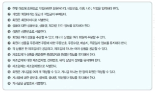

설계  2단계:  개념적  설계

- 목적: 

⋅DBMS에  독립적인  개념적  스키마  설계

⋅요구사항  분석  결과물을  개념적  데이터  모델을  이용해    개념적  구조로  표현(개념적  모델링)

⋅일반적으로  E-R  모델을  많이  이용

- 결과물:  개념적  스키마:  E-R  다이어그램
- 주요  작업:  요구사항  분석  결과를  기반으로  중요한 개체를  추출하고  개체  간의  관계를  결정하여  E-R 다이어그램으로  표현
- 작업  과정:

⋅STEP  1)  개체  추출,  각  개체의  주요  속성과  키  속성 

`   `선별

⋅STEP  2)  개체  간의  관계  결정

⋅STEP  3)  E-R  다이어그램으로  표현

개념적  설계  **–**  (STEP  1)  개체와  속성  추출

- 개체:  저장할  만한  가치가  있는  중요  데이터를  가진 사람이나  사물  등
- 개체  추출  방법:

⋅요구  사항  문장에서  업무와  관련이  깊은  의미  있는    명사를  찾음

- 업무와  관련이  적은  일반적이고  광범위하  의미 

`     `명사는  제외

- 의미가  같은  명사가  여러개일  경우는  대표  명사 

`     `하나만  선택

⋅찾아낸  명사를  개체와  속성으로  분류

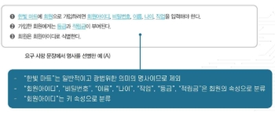

- 요구사항  명세서에서  개체와  속성을  추출하는  결과 ⋅개체:  회원

  ⋅“회원”  개체의  속성:  회원아이디,  비밀번호,  이름,     나이,  직업,  등급,  적립금

  ⋅“회원”  개체의  키  속성:  회원아이디

⋅개체:  회원,  상품

⋅속성:  주민번호,  주문수량,  배송지,  주문일자

- 위  속성들은  회원이  상품을  주문을  해야  생기는 

`     `정보이기에  회원이나  상품  개체의  속성으로  보기는 

`     `어렵고  이후  추출할  특정  관계의  속성일  가능성  높음

|회원|
회원아이디,  비밀번호,  이름,  나이,  직업, 

등급,  적립금
|
| - | - |
|상품|상품번호,  상품명,  재고량,  단가|
|제조업체|제조업체명,  전화번호,  위치,  담당자|
|게시글|글번호,  글제목,  글내용,  작성일자|

⋅E-R  다이어그램

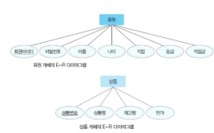

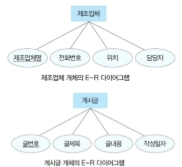

개념적  설계  -  (STEP  2)  관계  추출

- 관계:  개체  간의  의미  있는  연관성
- 관계  추출  방법: 

⋅요구  사항  문장에서  개체  간의  연관성을  의미  있게 표현한  동사  찾기

- 의미가  같은  동사가  여러개일  경우  대표  동사  하나만 

⋅찾아낸  관계에  대해  매핑  카디널리티와  참여  특성을 

`   `결정

- 매핑  카디널리티:  일대일,  일대다,  다대다
- 참여특성:  필수적  참여/선택적  참여



- 요구  사항  명세서에서  관계를  추출한  결과

⋅관계:  주문

- “회원”  개체와  “상품”  개체가  맺는  관계,  다대다
- “회원”  개체와  “상품”  개체는  관계에  선택적  참여

⋅“주문”  관계속성:주문번호,  주문수량,  배송지,  주문일자

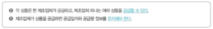

⋅관계:  공급

- “상품”  개체와  “제조업체”  개체가  맺는  관계,  일대다
- “상품”  개체는  관계에  필수적  참여  /  “제조업체” 

`      `개체는  관계에  선택적  참여

⋅“공급”  관계의  속성:  공급일자,  공급량

⋅관계:  작성

- “회원”  개체와  “게시글”  개체가  맺는  관계,  일대다
- “회원”  개체는  관계에  선택적  참여  /  “게시글” 

`      `개체는  관계에  필수적  참여

|관계|관계에  참여하는 개체|관계  유형|속성|
| - | :-: | - | - |
|주문|회원(선택) 상품(선택)|다대다|주문번호,  주문수량, 배송지,  주문일자|
|공급|상품(필수) 제조업체(선택)|일대다|공급일자,  공급량|
|작성|회원(선택) 게시글(필수)|일대다||

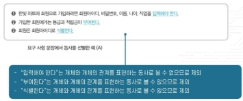

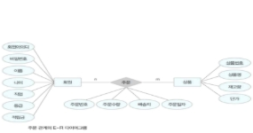

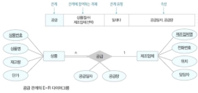

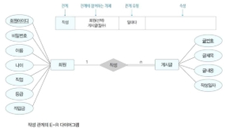

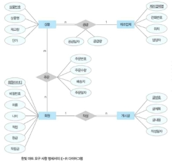

논리적  설계

설계  3단계:  논리적  설계

- 목적:

⋅DBMS에  적합한  논리적  스키마  설계

⋅개념적  스키마를  논리적  데이터  모델을  이용해  논리적 구조로  표현(논리적  모델링;  데이터  모델링)

- 일반적으로  관계  데이터  모델을  많이  이용
- 결과물:  논리적  스키마:  릴레이션  스키마
- 주요  작업:

⋅개념적  설계  단계의  결과물인  E-R  다이어그램을 릴레이션  스키마로  변환

⋅변환  후  속성의  데이터  타입,  길이,  널  값  허용  여부, 기본값,  제약조건  등  세부적으로  결정하고  결과를  문서화 

–  E-R  다이어그램을  릴레이션  스키마로  변환하는  규칙 ⋅규칙1:  모든  개체는  릴레이션으로  변환 ⋅규칙2:  다대다  관계는  릴레이션으로  변환

⋅규칙3:  일대다  관계는  외래키로  표현

⋅규칙4:  일대일  관계는  외래키로  표현

⋅규칙  5:  다중  값  속성은  릴레이션으로  변환

- 변환  규칙을  순서대로  적용하되,  해당되지  않는  규칙은 제외

논리적  설계  -  (규칙1)  모든  개체는  릴레이션으로  변환

- E-R  다이어그램의  각  개체를  하나의  릴레이션으로 

  변환

⋅개체의  이름  ->  릴레이션의  이름

⋅개체의  속성  ->  릴레이션의  속성

⋅개체의  키  속성  ->  릴레이션의  기본키

⋅개체의  속성이  복합  속성인  경우에는  복합  속성을 

`   `구성하고  있는  단순  속성만  릴레이션의  속성으로  변환

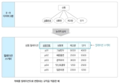

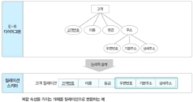

논리적  설계  -  (규칙2)  다대다  관계는  릴레이션으로  변환

- E-R  다이어그램의  다대다  관계를  하나의  릴레이션으로 변환

⋅관계의  이름  ->  릴레이션의  이름

⋅관계의  속성  ->  릴레이션의  속성

⋅관계에  참여하는  개체를  규칙  1에  따라  릴레이션으로 

`   `변환한  후  이  릴레이션의  기본키를  관계  릴레이션에 

`   `포함시켜  외래키로  지정하고,  외래키들을  조합하여 

`   `관계  릴레이션의  기본키로  지정

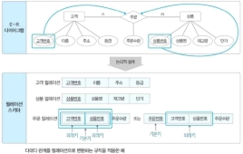

논리적  설계  -  (규칙3)  일대다  관계는  외래키로  표현

- (규칙  3-1)  일반적인  일대다  관계는  외래키로  표현 ⋅일대다  관계에서  1측  개체  릴레이션의  기본키를  n측    개체  릴레이션에  포함시켜  외래키로  지정

  ⋅관계의  속성들도  n측  개체  릴레이션에  포함시킴

  ![ref1]

- (규칙  3-2)  약한  개체가  참여하는  일대다  관계는 외래키를  포함해서  기본키를  지정

⋅일대다  관계에서  1측  개체  릴레이션의  기본키를  n측 개체  릴레이션에  포함시켜  외래키로  지정

⋅관계의  속성들도  n측  개체  릴레이션에  포함시킴

⋅n측  개체  릴레이션은  외래키를  포함하여  기본키를  지정

- 약한  개체는  강한  개체에  따라  존재  여부가 

`     `결정되므로  강한  개체의  기본키를  이용해  식별

![ref2]

논리적  설계  -  (규칙  4)  일대일  관계는  외래키로  표현

- (규칙  4-1)  일반적인  일대일  관계는  외래키를  서로 주고  받음

⋅관계에  참여하는  개체  릴레이션들이  서로의  기본키를    주고받아  외래키로  지정

⋅관계의  속성들도  모든  개체  릴레이션에  포함  시킴 ⋅불필요한  데이터  중복이  발생할  수  있음

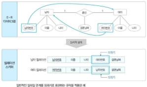

- (규칙  4-2)  필수적으로  참여하는  개체  릴레이션만 외래키를  받음

⋅관계에  필수적으로  참여하는  개체  릴레이션에만 

`   `외래키를  포함시킴

⋅관계의  속성들은  관계에  필수적으로  참여하는  개체    릴레이션에  포함시킴

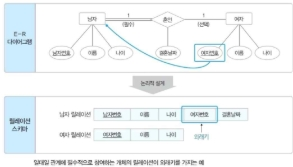

- (규칙  4-3)  모든  개체가  필수적으로  참여하면  릴레이션 하나로  합침

⋅관계에  참여하는  개체  릴레이션들을  하나의 

`   `릴레이션으로  합쳐서  표현

⋅관계의  이름을  릴레이션  이름으로  사용하고,  관계에 

`   `참여하는  두  개체의  속성들을  관계  릴레이션에  모두 

`   `포함시킴

⋅두  개체  릴레이션의  키  속성을  조합하여  관계  

`   `릴레이션의  기본키로  지정

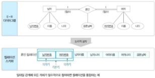

논리적  설계  -  (규칙  5)  다중  값  속성은  릴레이션으로 변환

- E-R  다이어그램의  다중  값  속성은  독립적인 릴레이션으로  변환

⋅다중  값  속성과  함께  그  속성을  가지고  있던  개체 

`   `릴레이션의  기본키를  외래키로  가져와  새로운 

`   `릴레이션에  포함시킴

⋅새로운  릴레이션의  기본키는  다중  값  속성과  외래키를    조합하여  지정

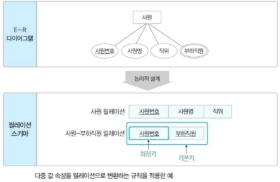

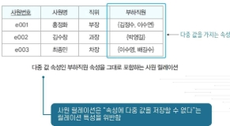

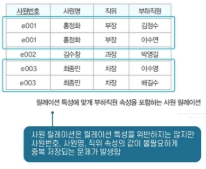

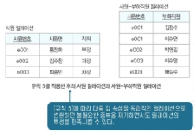

논리적  설계  **–**  기타  고려사항

- 모든  관계를  독립적인  릴레이션으로  변환할  수  있음
- 속성이  많은  관계는  유형에  상관없이  릴레이션으로의 변환을  고려할  수  있음

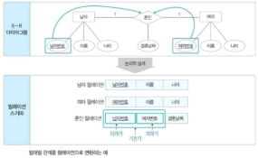

릴레이션  스키마  변환  규칙을  이용한  논리적  설계  예

- E-R  다이어그램을  릴레이션으로  변환하는  과정
- STEP1)  규칙1  적용(모든  개체는  릴레이션으로  변환)

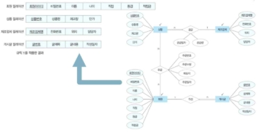

- STEP2)  규칙2  적용(다대다;  n:m관계는  릴레이션으로)

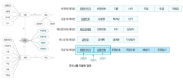

- STEP3)  규칙3  적용(일대다;  1:n관계는  외래키로)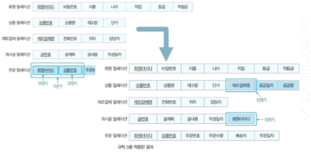

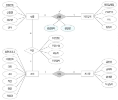

- 개체가  자기  자신과  관계를  맺는  순환  관계도  기본 규칙을  그대로  적용
  - STEP4)  규칙4  적용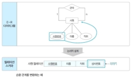
  - STEP5)  규칙5  적용
  - 최종결과

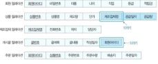

논리적  설계  **–**  테이블  명세서  작성

- 릴레이션  스키마  변환  후  속성의  데이터  타입과  길이, 널  값  허용  여부,  기본값,  제약조건  등을  세부적으로 결정하고  문서화  시킴
- 테이블  명세서:  릴레이션  스키마에  대한  설계  정보를 기술한  문서

  

물리적  설계와  구현

설계  4단계:  물리적  설계

하드웨어나  운영체제의  특성을  고려하여  필요한  인덱스 구조나  내부  저장  구조  등에  대한  물리적인  구조를  설계

설계  5단계:  구현

SQL로  작성한  명령문을  DBMS에서  실행하여 데이터베이스를  실제로  생성

[ref1]: Aspose.Words.72039e57-98b6-4813-a9e4-72d17882bef1.030.jpeg
[ref2]: Aspose.Words.72039e57-98b6-4813-a9e4-72d17882bef1.031.jpeg

